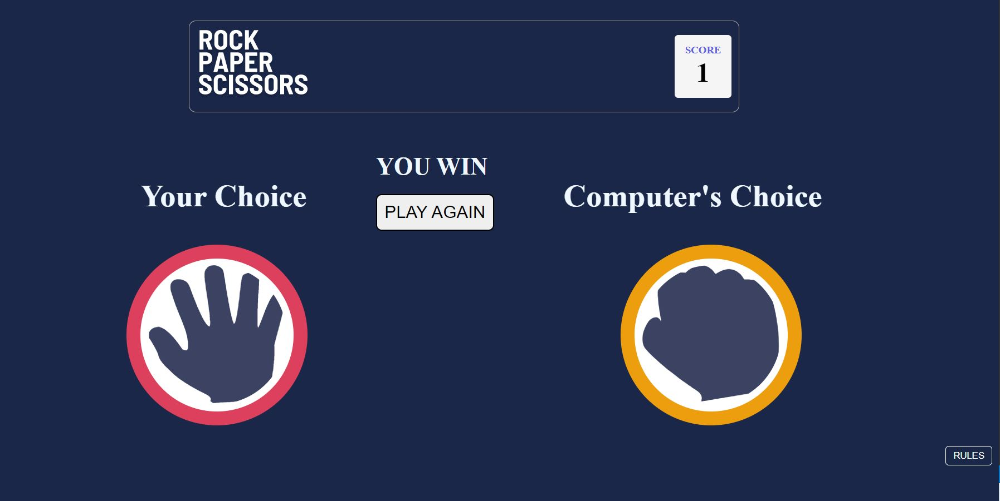

<h1 align="center" >  Rock, Paper, Scissors </h1>
<h3 align="center">A challenge from Frontend Mentor </h3>  

<!-- TABLE OF CONTENTS -->
<h2 id="table-of-contents">  Table of Contents</h2>

  
Table of Contents

  <ol>
    <li><a href="#about-the-project"> ➤ About The Project</a></li>
    <li><a href="#The-challenge"> ➤ The challenge</a></li>
    <li><a href="#prerequisites"> ➤ Prerequisites/Tech used</a></li>
    <li><a href="#step-of-game"> ➤ Steps of Game</a></li>
   
  </ol>

<!-- ABOUT THE PROJECT -->
<h2 id="about-the-project">  About The Project</h2>

 
    In this project, I build out this Rock, Paper, Scissors game from start. it's a very popular game from our childhood, learned new things while building this as well as enjoyed a lot

          

<h2 id="The-challenge"> The challenge</h2>

 
   The challenge is to build out this Rock, Paper, Scissors game and get it looking as close to the design as possible.

    users should be able to:
  * View the optimal layout for the game depending on their device's screen size
  * Play Rock, Paper, Scissors against the computer

<!-- PREREQUISITES -->
<h2 id="prerequisites">  Prerequisites/Tech used</h2>
<!--This project is written in Python programming language.  -->
The following Langauge/freamwork/technologies are used in this project:
* HTML
* CSS
* Javascript
* Dom manipulation
* Git-version control
* Github repo
* GitHub Pages

<h2 id="step-of-game">Steps of Game</h2>

Start the game by selecting any one of these sings

          

If you WIN the game, you will get one point

          

Click on PLAY AGAIN to continue 

          

If you LOSE, 1 point will be deducted from your score 

          

If the game gets DRAW, points will remain as it was

          

HAVE FUN !
